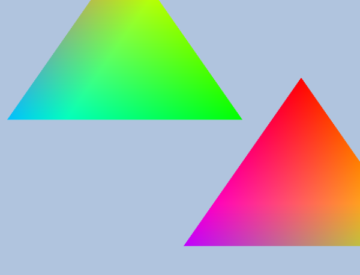

# Rendering Pipeline

3차원의 가상 세계를 2차원의 이미지로 생성하는데 필요한 일련의 단계들을 렌더링 파이프라인(Rendering Pipeline)이라고 부른다.

## 그래픽스 파이프라인 과정

1. 입력 조립기
1. 버텍스 셰이더
1. 테셀레이션
1. 지오메트리 셰이더
1. 레스터라이저
1. 픽셀 셰이더
1. 출력 병합기

## 입력 조립기(Input Assembler)

메모리에서 기하 자료(정점, 인덱스)를 읽어서 기본 도형을 조립한다.

### Primitive topology

정점들을 어떻게 엮어서 구조를 형성할 것인지 알려주는 수단이 Primitive topology이다. 정점을 두개 씩 엮어서 선분을 형성할 수도 있고, 세 개씩 엮어서 삼각형을 형성할 수도 있다. 거의 대부분 Trianglelist을 Primitive topology로 사용한다.

## 버텍스 셰이더(Vertex Shader)

### 로컬 스페이스

원점을 기준으로 얼마나 떨어진 위치에 Vertex가 있는지 나타낸 좌표 시스템

### 월드 스페이스

로컬 스페이스 좌표를 가진 하나의 도형을 월드 좌표에 배치
이때 물체의 TRS(이동, 회전, 변경)의 연산을 적용한 것이 월드 좌표가 된다
[스자이공부](./SRTRP.md)

### 뷰 스페이스

카메라를 원점기준으로 맞춰주면서 월드 좌펴에 있는 사물을 그에 맞게 이동하는 작업 world space에서 view space로의 좌표 변환을 view transfrom이라 부르고, 해당 변환을 수행하는 행렬을 view matrix라고 한다.

### 투영

카메라를 기준으로 최종 렌더링에 출력될 물체들이 있는 공간, 즉 카메라에 보이는 공간을 절두체(frustum)이라고 한다. 3차원 기하구조를 2차원으로 투영함으로 3차원 장면을 2차원 이미지로 표현할 수 있게 된다.

투영은 물체의 3차원 깊이가 증가함에 따라 투영의 크기가 감소하는 방식으로 수행해야 한다. 이것을 원근 투영이라고 한다.

### 클리핑

뷰 스페이스 안으로 들어오지 않는 오브젝트를 컬링하는 것

## 테셀레이션(Tessellation)

주어진 메시의 삼각형들을 더 잘게 쪼개서 새로운 삼각형을 만들어 내는 과정. 새 삼각형들은 원래 메시에 없는 세부적인 특징을 만들어 낼 수 있다.

### 테셀레이선의 장점

1. 카메라에 가까운 삼각형은 테셀레이션을 적용해 세부도를 높이고, 먼 삼각형들은 적용하지 않는 방식의 LOD를 구현할 수 있다
1. 적은 수의 삼각형으로 이루어진 메시를 메모리에 담아두고 즉성으로 삼각형을 추가하여 메모리를 절약할 수 있다.
1. 애니메이션시 계산량을 줄일 수 있다.

## 지오메트리 셰이더(Geometry Shader)

하나의 기본 도형을 입력받아 그것을 임의로 변형하는 셰이더이다. 버텍스 셰이더에서 처리한 기하구조를 GPU에서 추가적으로 생성하거나 파괴할 수 있다. 주로 점이나 선분을 사각형으로 확장하는 일에 사용된다.

## 레스터라이저(Rasterizer)

화면을 출력할 때 필요한 픽셀의 색상을 계산하는 과정. 버텍스 셰이더로부터 전달 받은 정점들의 색을 보간하여 픽셀을 채워준다.(이미지 참고, 삼각형 각 정점들의 색이 보관되어 픽셀에 표현됨)

### 뷰포트 변환

원근 투영변환을 마치고 나면 하드웨어에서 원근 나누기를 수행해 정규화된 좌표공간으로 변환한다. 이 공간은 2차원의 x,y 좌표 성분들의 직사각형 영역 안으로 변환되는데 그 직사각형이 바로 뷰포트이다. 뷰포트 변환을 마치고 난 x,y 성분이 픽셀 단위의 값이 된다.

### 백페이스 컬링

카메라에 보이지 않는 '면'을 제거하는 것
CCW를 이용하여 반시계 방향 순서로 이루어진 도형을 컬링
[컬링](./Culling.md)

## 픽셀 셰이더(Pixel shader)

각 픽셀에 대해 수행되는 셰이더로 조명, 반사, 그림자 효과 등 더 복잡한 작업을 수행한다. 픽셀 셰이더의 연산 수는 버텍스 셰이더보다 어마어마하게 많기 때문에 비슷한 결과물을 출력한다면 버텍스 셰이더에서 처리하는 것이 유리하다.

## 출력 병합기(output merger)

픽셀 셰이더가 생성한 데이터가 입력되며, 이 단계에서 일부 픽셀 단편들이 폐기될 수 있다. (깊이 혹은 스텐실 판정에 의해) 폐기 되지 않은 픽셀 단편들은 백버퍼에 기록되며 blending도 이 단계에서 일어난다.

### 조명

#### 빛의 종류

- Ambient: 환경광, 다른 표면에 반사되어서 빚추는 빛
- Diffuse: 특정한 방향으로 진행되며, 모든 방향으로 동일하게 반사되는 빛
- Specular: 특정 방향으로 강하게 반사되는 빛, 특정 각도에서만 보이는 빛(pow함수 이용)

#### 광원의 종류

- Point Light: 한 점에서 구 형태로 빛이 뻗어 나가는 광원
- Directional Light: 일정한 방향으로 모든 공간에 뻗어나가는 광원
- Spot Light: 손전등처럼 원뿔 모양으로 뻗어나가는 광원

# Reference

[늑대발바닥/렌더링파이프라인](https://m.blog.naver.com/winterwolfs/10171439609)

[입코딩/렌더링파이프라인](https://lipcoder.tistory.com/112)

개인 경험 및 지식
