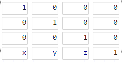

# SRTRP(스자이공부)

월드 스페이스에서 물체를 월드 좌표에 배치할 때 행렬을 연산하는 순서
이때 하나의 연산을 표현하기 위해 4X4 행렬을 사용하며, 이를 변환행렬이라고 한다.

## 4X4 행렬을 사용하는 이유

3차원 벡터의 Translation을 표현하기 위해서는 4x4행렬이 필요하다. 왜냐하면 행렬은 위치와 무관하게 오직 방향과 크기만 서술하기 때문이다. 이를 이용하기 위해 3차원 벡터를 (x,y,z,1)과 같은 형태의 4차원 벡터로 가정하고 연산을 진행하며 이를 동차 좌표계라고 한다. 4차원 벡터의 w값을 0으로 설정하는 경우 이동 변환은 적용되지 않는다.

## 이동 행렬



## 회전 행렬


## 스케일 행렬


## 행렬의 연산 순서

1. Scale(크기 변경)
1. Rotation(자전)
1. Translation(이동)
1. Rotation(공전)
1. Parent(부모)

흔히 국내에서 이를 스자이공부(혹은 크자이공부)라고 부른다

이를 D3DX 코드로 표현하면 아래와 같다

```C++
D3DXMatrixScaling( &matScale , m_Info.vScale.x , m_Info.vScale.y , m_Info.vScale.z );
 D3DXMatrixRotationX( &matRotX , m_Info.vRot.x );
 D3DXMatrixRotationY( &matRotY , m_Info.vRot.y );
 D3DXMatrixRotationZ( &matRotZ , m_Info.vRot.z );
 D3DXMatrixTranslation( &matPos , m_Info.vPos.x , m_Info.vPos.y, m_Info.vPos.z );
 D3DXMatrixRotationAxis( &matRev , &m_Info.vRev ,  m_Info.fRev );

 m_matWorld = matRotX* matRotY * matRotZ * matPos * matRev * (*m_Info.pParent );
 matWorld   = matScale * m_matWorld;

 m_pd3dDevice->SetTransform( D3DTS_WORLD , &matWorld );  //월드 좌표로 셋업
```

## Reference

변환행렬 - Wikipedia